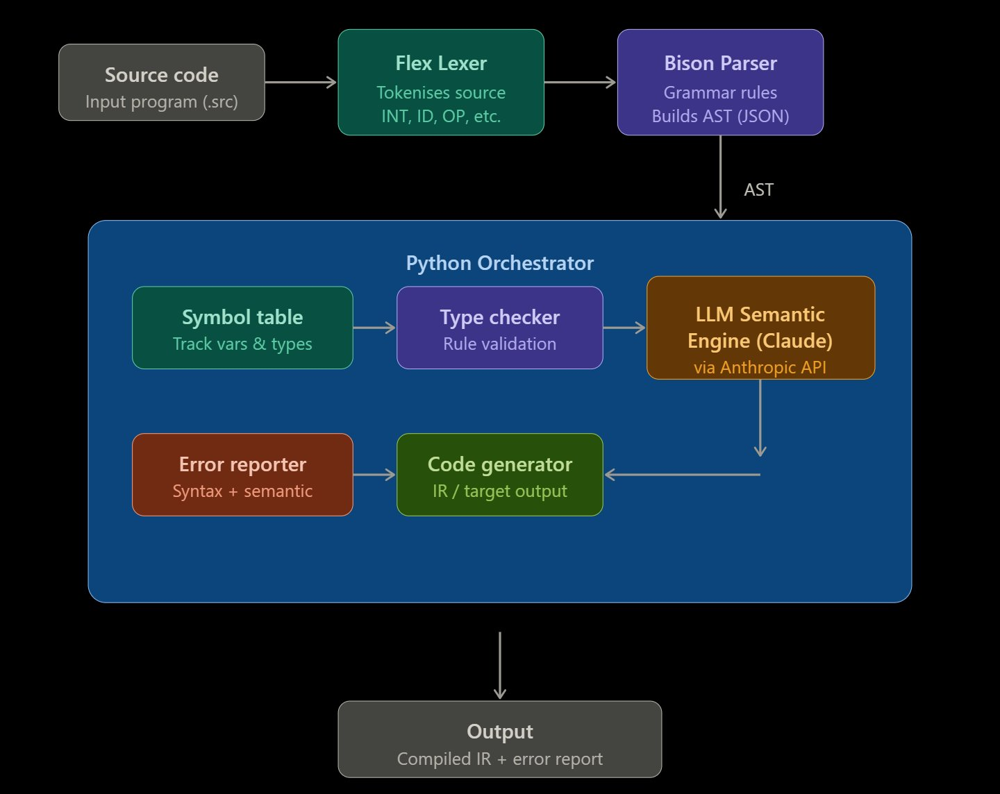

# LLM-Powered Semantic Analysis for Compilers
### Flex + Bison + Python + LLM (Groq / Gemini / Claude)

A complete compiler pipeline combining classical compiler theory (lexing, parsing,
type-checking) with LLM-powered deep semantic analysis.

## Architecture



The pipeline flows from source code → Flex Lexer → Bison Parser → Python Orchestrator
(Symbol Table → Type Checker → LLM Semantic Engine → IR Generator) → Output.

## Files

| File                  | Description |
|-----------------------|-------------|
| `backend/lexer.l`     | Flex rules — tokenises source into INT, FLOAT, ID, operators |
| `backend/parser.y`    | Bison grammar — 40+ rules, emits full JSON AST |
| `backend/compiler.py` | Python orchestrator — type checker, LLM analysis, IR generator |
| `backend/Makefile`    | Builds the Flex/Bison C binary |
| `backend/test.src`    | Sample source program |

## Language Features

- **Types**: `int`, `float`, `string`, `bool`
- **Declarations** with initialisation: `int x = 5;`
- **Assignment**: `x = x + 1;`
- **Arithmetic**: `+  -  *  /  %`  and unary `-`
- **Comparisons**: `==  !=  <  >  <=  >=`
- **Logic**: `&&  ||  !`
- **Control flow**: `if / else`,  `while`
- **Functions**: `func int factorial(int n) { ... }`
- **Print**: `print(expr);`
- **Comments**: `// line comments`

## Build & Run

```bash
# Prerequisites: flex, bison, gcc, python3, pip3
cd backend
make                                   # compile Flex/Bison binary

# Set ONE of these API keys (Groq is free and recommended)
export GROQ_API_KEY=gsk_...            # free — console.groq.com
export GEMINI_API_KEY=AIzaSy...        # free — aistudio.google.com
export ANTHROPIC_API_KEY=sk-ant-...    # paid — console.anthropic.com

pip3 install requests flask flask-cors # install Python dependencies

python3 compiler.py test.src           # run on sample program
python3 compiler.py my_program.src     # run on your own file
```

## Pipeline Stages

### 1 — Flex Lexer (backend/lexer.l)
Converts raw source to a token stream. Tracks line numbers, handles
unknown characters, and distinguishes keywords from identifiers.

### 2 — Bison Parser (backend/parser.y)
Full grammar definition. Each rule emits a JSON node; the result is a
single `{"type":"Program","body":[...]}` document written to stdout.

### 3 — Python Rule-Based Type Checker
- Scoped symbol table (push/pop on `{}` blocks)
- Re-declaration and undeclared-variable detection
- Type-compatibility checking for all binary operators
- Assignment type-mismatch detection
- Unused-variable warnings

### 4 — LLM Semantic Analysis (Groq / Gemini / Claude)
Supports three backends — auto-selected based on which API key is set:
- **Groq** (free) — set `GROQ_API_KEY` at console.groq.com
- **Gemini** (free) — set `GEMINI_API_KEY` at aistudio.google.com
- **Claude** (paid) — set `ANTHROPIC_API_KEY` at console.anthropic.com

The LLM reasons about:
- Semantic errors missed by the rule-based pass
- Logic bugs (off-by-one, dead code, unreachable branches)
- Code quality (naming, style, runtime risks)
- Optimisation hints (constant folding, loop invariants)
- Overall verdict: `PASS` / `WARNINGS` / `FAIL`

### 5 — IR Code Generator
Produces simple 3-address IR:
```
DECL int x
STORE x = 5
t1 = x + 3
JMPF t1 L_else_1
LABEL L_else_1:
```

## Extending the Compiler

| Goal | File |
|------|------|
| New token (e.g. `++`) | `backend/lexer.l` |
| New statement (e.g. `break`) | `backend/parser.y` |
| New type rule | `backend/compiler.py` → `TYPE_COMPAT` or `TypeChecker` |
| Richer IR | `backend/compiler.py` → `IRGenerator` |
| Custom LLM analysis rules | `backend/compiler.py` → `SYSTEM_PROMPT` |

## Exit Codes

| Code | Meaning |
|------|---------|
| `0` | Compiled successfully |
| `1` | Type errors or LLM verdict = FAIL |